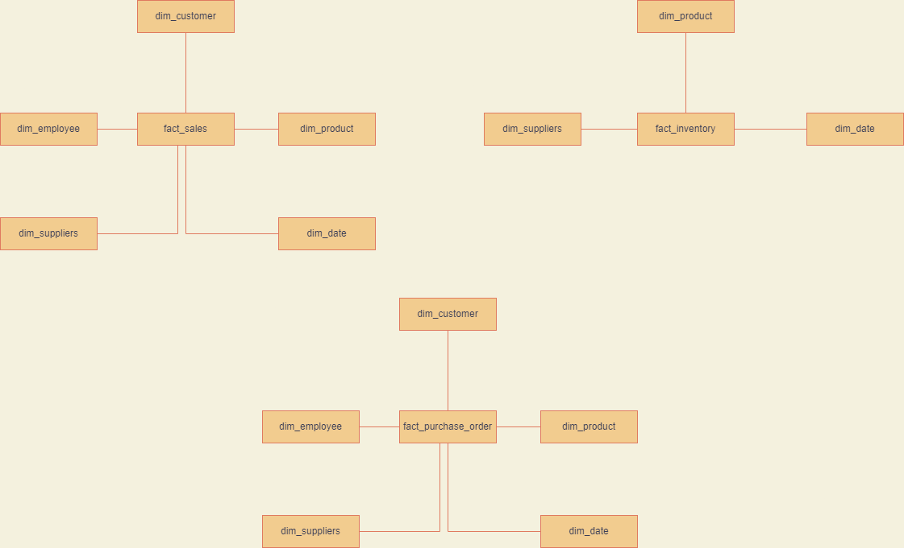

# Requirement Gathering 

## Business Processes 
1. Sales Overview 
- Overall sales reports to understand what is being sold, what sells the most, where and what sells the least. The goal is to have general overview if how the business is going
2. Sales Agent Tracking 
- Track Sales and performance of each sales agent to adjust commissions, reward high achiever and empower low achievers
3. Product Inventory
- Understand the current inventory levels how to improve stock management, which suppliers do we have and how much is being purchased.This will allow us to understand stock management and potentially broker better deals with suppliers 
4. Customer Reporting
- Allow customers to understand their purchase orders, how much and when are they buying, empowering them to make data driven decisions and utilize the data to join to thier sales data 

## Data Profiling
- Go through the business process and try to find table(s) from the OLTP systems which would be needed for dimension modelling. (*This is top level analysis dont need to profiles all tables from OLTP systems*)
- Check if certain columns in the table have placeholder values,if the primary key of the table has null values and not distinct or unique,if there are duplicate entries in the table 
- Use below sample query 
```sql
select 
id as column_name,
sum(case when id is null then 0 else 1 end)/cast(count(*) as numeric) as not_null_proportion,
count(distinct id)/cast(count(*) as numeric) as distinct_proportion,
count(distinct id) as distinct_count,
count(distinct id) = count(*) as is_unique,
current_timestamp() as profiled_at
from `data-engineering-467607.dl_northwind.customer`
group by all 
```
### Selected Tables
(*We mark [E] next to to table name indicating if it is been selected as an entity*)
- Customers[E] : Customer record who place an order at Northwind
- Employees[E] : People who work at Northwind
- Orders[E] : Customer order transaction(s)
- Order Details[E] : Order details for orders
- Inventory Transaction[E] : Transaction details of each inventory 
- Products[E] : Products sold or planned to be sold by Northwind
- Shippers[E] : Ships orders to customers
- Suppliers[E] : Sellers who provide products 
- Invoices[E] : Sale order invoice 

## Bus Matrix High Level Entities


## Conceptual Model


# Architecture Diagram 


# Logical Model


# Physical Model
